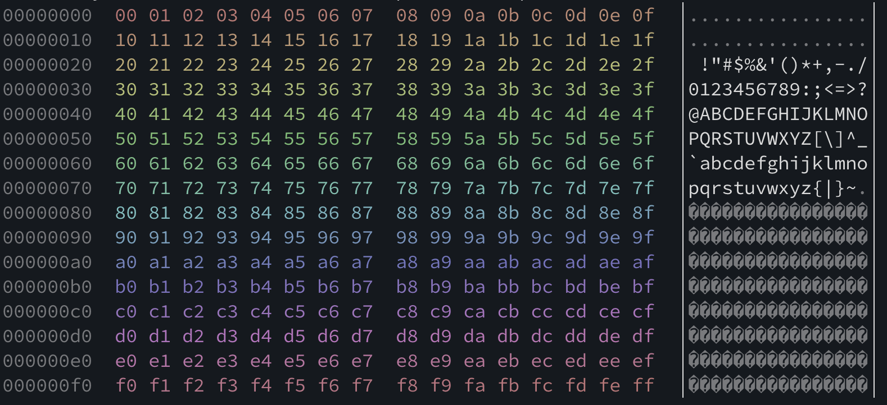
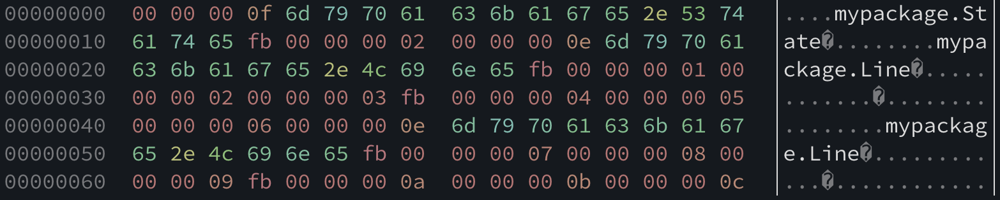

# hexdump4s

I recently encountered a distributed application that stored some cached state in DynamoDB. The application used [scala-pickling](https://github.com/scala/pickling) to encode/decode its state to/from binary. Unfortunately, scala-pickling is no longer maintained and was last released for Scala 2.11. Resultantly, this application was stuck on Scala 2.11 with no upgrade path.

One approach to this problem is changing the binary format stored in DynamoDB to something well supported (e.g. protobuf) and clearing the cache at time of deployment. That comes with a significant disadvantage though -- we'd need the ability to gradually deploy a new application version to various nodes, which means for a period of time we'd have both the old and new versions of the application running against the same database.

Instead, we could store the new binary format in new tables while keeping the scala-pickling based format in the original tables. This would allow for rolling upgrades and rollbacks, but with the disadvantage of the cluster state being split between the old and new nodes.

For this particular application, neither of these options were desirable. Instead, we wanted to continue to read and write cluster state in the existing binary format while also upgrading to modern Scala releases. To do so, we decided to reverse engineer the scala-pickling binary format with [scodec](https://scodec.org). In the process, we added hex dump support to scodec and built a native application using [scala-cli](https://scala-cli.virtuslab.org). In this article, we'll explore how this was done.

## Scala Pickling

The Scala Pickling library supports compile time generation of binary encoders and decoders (JSON is also supported, though we're not using it here). Consider the type `Line`, which consists of two `Point`s:

```scala
package mypackage 

case class Point(x: Int, y: Int, z: Int)
case class Line(start: Point, end: Point)
```

To serialize a `Line` to binary, we can add a few imports from the `scala.pickling` package and call `.pickle` on an instance of `Line`:

```scala
import scala.pickling.Defaults._
import scala.pickling.binary._
import scodec.bits.ByteVector

val line = Line(Point(1, 2, 3), Point(4, 5, 6))
val bytes = ByteVector.view(line.pickle.value)
```

`line.pick.value` returns an `Array[Byte]`, which we wrap with a `scodec.bits.ByteVector`. We can inspect this byte vector in various ways:

```scala mdoc:invisible
import scodec.bits._
val bytes = hex"0000000e6d797061636b6167652e4c696e65fb000000010000000200000003fb000000040000000500000006"
```
```scala mdoc
println(bytes.toHex)

println(bytes.decodeAscii)

println(bytes.drop(4).take(15).decodeAsciiLenient)
```

Inpsecting the hex string provides some clues about how Scala Pickling has serialized the `Line` and `Point` types. The right half of the vector shows the integers 1, 2, 3 and then 4, 5, 6, and there's a `0xfb` character preceeding each triple. The left half of the vector has a dense section of bytes mostly in the `0x50-0x80` range. Decoding the whole vector as ASCII fails, but decoding it leniently, where unmappable charaters are replaced with `�`, shows that the fully qualified class name of `Line` is included.

We can do more experiments in a similar way -- e.g., changing one of the paramters to one of our `Point` instances and comparing the hex output to the original output, confirming the change occurs where we expect. We may also want to use `drop` and `take` and other operations on `ByteVector` when exploring the example output. To assist with visual inspection of the results, let's define a utility function to print a hex dump with 16 bytes per line.

```scala mdoc
def dumpHexBasic(bs: ByteVector): Unit =
  println(bs.grouped(16).map(_.toHex).mkString("\n"))

dumpHexBasic(bytes)
```

The `grouped` operation does most of the heavy lifting here -- `grouped` converts a `ByteVector` in to an `Iterator[ByteVector]`, where each inner vector is the specified number of bytes, except the last vector which may be less.

Despite using scodec for nearly a decade, working with a wide variety of binary protocols, and writing variants of this function dozens of times, it doesn't exist directly in the library (or rather, didn't exist until it was added as part of this article). We can add a variety of useful features to this function -- features that we wouldn't take the time to define in an adhoc debugging session but would be very useful.

For example, we can add another column to the output with the decoded ASCII of each line:

```scala mdoc
def dumpHexAndAscii(bs: ByteVector): Unit =
  val str = bs
    .grouped(16)
    .map(line => line.toHex + " " + line.decodeAsciiLenient)
    .mkString("\n")
  println(str)
```

This implementation has a problem though -- the decoded ASCII often has non-printable characters, e.g. tabs, carriage returns, backspaces. We need to replace the non-printable characters with a placeholder character.

```scala mdoc
val NonPrintablePattern = "[^�\\p{Print}]".r

def printable(s: String): String = 
  NonPrintablePattern.replaceAllIn(s, ".")

def dumpHexAndPrintableAscii(bs: ByteVector): Unit =
  val str = bs
    .grouped(16)
    .map { line => 
      line.toHex + " " + printable(line.decodeAsciiLenient)
    }
    .mkString("\n")
  println(str)

dumpHexAndPrintableAscii(bytes)
```

This is close, but the ASCII column in the last line is not aligned with the previous lines. Let's fix that while also adding an address column at the start of each line, specifying the index of the byte the line starts with.

```scala mdoc
def dumpHex(bs: ByteVector): Unit =
  val str = bs
    .grouped(16)
    .zipWithIndex
    .map { case (line, idx) => 
      val address = ByteVector.fromInt(idx * 16).toHex
      val data = line.toHex
      val ascii = printable(line.decodeAsciiLenient)
      val padding = 2 * (16 - line.size.toInt) + 1
      address + " " + data + (" " * padding) + ascii
    }
    .mkString("\n")
  println(str)

dumpHex(bytes)
```

With this new `dumpHex` routine, let's look at a couple more examples of pickling.

```scala
val p = Point(7, 8, 9)
val bytesPoint = ByteVector.view(p.pickle.value)
```
```scala mdoc:invisible
case class Point(x: Int, y: Int, z: Int)
case class Line(start: Point, end: Point)
val bytesPoint = hex"0000000f6d797061636b6167652e506f696e74000000070000000800000009"
```
```scala mdoc
dumpHex(bytesPoint)
```

This time, we can see the fully qualified class name of `Point` appears in the pickled output, unlike when we pickled `Line`, which only included the fully qualified class name of `Line`.

Let's also look at the first 4 bytes -- `0x0000000f` -- or 15 in decimal. This is the length of the string `mypackage.Point`. In the pickled output of `Line` from earlier, we similarly see the first 4 bytes are `0x0000000e`, or 14 decimal, which is the length of the string `mypackage.Line`.

There are two reasonable guesses we can make here about the Scala Pickling binary format:
* Strings are encoded as a 4-byte integer, specifying the number of subsequent bytes to read, followed by a UTF-8 (or perhaps ASCII) encoding of the string.
* Pickling an object results in the fully qualified class name of the object being encoded as a string.

The scodec library provides a built-in codec for UTF-8 strings prefixed by a 32-bit integer size field:

```scala mdoc
import scodec.codecs._

println(utf8_32.encode("Hello, world!"))
```

The `utf8_32` codec is an alias for `variableSizeBytes(int32, utf8)` -- the `variableSizeBytes` operation builds a codec from a size codec and a value codec. The size codec specifies the format of the size of the value in bytes and the value codec subsequently only sees the specified number of bytes from the input.

When we decode a pickled value, we don't really want to do anything with the resulting string that specifies a class name. Rather, we want to write a codec for a specific class -- e.g. `Point` or `Line` -- where we know the input should start with the fully qualified class name. Let's define this.

```scala mdoc
import scodec.Codec

def constantString(s: String): Codec[Unit] =
  utf8_32.unit(s)

val helloWorld = constantString("Hello, world!")

println(helloWorld.encode(()))
```

Looking back at the pickled version of `Point`, we see that after the fully qualified class name, the 3 component integers are encoded sequentially as 32-bit big endian values. We can build a codec for this format using scodec's built-in `int32` codec three successive times.

```scala mdoc
val pointComponents: Codec[(Int, Int, Int)] = int32 :: int32 :: int32

println(pointComponents.encode(1, 2, 3))
```

We can combine this with `constantString` to build a codec for `Point`:

```scala mdoc
val pointCodec =
  constantString("mypackage.Point") ~> (int32 :: int32 :: int32).as[Point]

println(pointCodec.decode(bytesPoint.bits))
```

And this same codec can generate binary output that's readable by Scala Pickling:

```scala mdoc
println(pointCodec.encode(Point(7, 8, 9)))
```

Let's look back at the pickled `Line` example now:

```scala mdoc
dumpHex(bytes)
```

Before each of the points, there's a `0xfb` character, and there's no appearance of the fully qualified class name of `Point`. It seems that when Scala Pickling has enough context to know the type of the next field in the binary, it elides type information. A quick scan through the Scala Pickling source shows [some constant byte tags](https://github.com/scala/pickling/blob/f7c64bc11f11e78e80ff326da9fbc4fa8d045a80/core/src/main/scala/scala/pickling/binary/BinaryPickleFormat.scala#L32) and confirms `0xfb` is the elided tag.

```scala mdoc
val pointElidedCodec =
  constant(0xfb) ~> (int32 :: int32 :: int32).as[Point]

val lineCodec =
  constantString("mypackage.Line") ~> (pointElidedCodec :: pointElidedCodec).as[Line]

println(lineCodec.decode(bytes.bits))
```

Let's look at the binary format of one more type, `State`, which stores a vector of lines:

```scala
case class State(lines: Vector[Line])

val s = State(Vector(
  Line(Point(1, 2, 3), Point(4, 5, 6)),
  Line(Point(7, 8, 9), Point(10, 11, 12))
))

val bytesState = ByteVector.view(s.pickle.value)
```
```scala mdoc:invisible
case class State(lines: List[Line])
val bytesState = hex"0000000f6d797061636b6167652e5374617465fb000000020000000e6d797061636b6167652e4c696e65fb000000010000000200000003fb0000000400000005000000060000000e6d797061636b6167652e4c696e65fb000000070000000800000009fb0000000a0000000b0000000c"
```
```scala mdoc
dumpHex(bytesState)
```

Here we see the expected `myPackage.State` string, followed by an elided type tag, then a 32-bit integer field specifying the number of elements in the vector. After the count field, there's two successive lines, both encoded with their fully qualified class name, not an elided type tag.

```scala mdoc
val stateCodec = constantString("mypackage.State") ~> constant(0xfb) ~> vectorOfN(int32, lineCodec)

println(stateCodec.decode(bytesState.bits))
```

Using `dumpHex`, we can continue to experiment with pickling more complex types and build up various codecs. For instance, serializing `Option` values, other collection types, and so on. For the rest of this article, we'll instead focus on improving `dumpHex`.

## Configurable hex dumps

Let's return to `dumpHex` and consider other features we might want. For inspiration, we can look at the [man page of Linux's hexdump](https://man7.org/linux/man-pages/man1/hexdump.1.html). What we've built so far loosely resembles the output of `hexdump -C`, with an address column, hex data column, and ASCII column. Let's support the following additional features:
- Improve formatting by using something similar to `hexdump`'s output.  Hex data will be organized in to 8 byte columns, with each byte separated by a space, and with each column separated by an additional space. We'll also add a border around the ASCII column.
- Support a configurable number of columns of data and number of bytes per column, using a default of 2 columns of 8 bytes each.
- Support suppressing the output of the address and/or ASCII column.
- Support customizing the hexadecimal alphabet (e.g. lowercase versus uppercase).

We could modify `dumpHex` to take a bunch of parameters with defaults, but this has a couple disadvantages. First, it makes it difficult to maintain binary compatibility if in a future version we want to add new configuration options. Second, it doesn't let us treat various combinations of settings as *values*. For instance, we may want to have a value that represents the default format and another that represents the format without the ASCII column. We can also use such values as starting points for futher customizations. We could represent a bunch of parameters with a case class, and various preconfigured parameter sets as values in the companion object of that case class. But we'd still have binary compatibility issues -- e.g., adding a parameter to the case class would not be binary compatible. Instead, the builder pattern aligns well with our requirements.

```scala
final class HexDumpFormat private (
    val includeAddressColumn: Boolean,
    val dataColumnCount: Int,
    val dataColumnWidthInBytes: Int,
    val includeAsciiColumn: Boolean,
    val alphabet: Bases.HexAlphabet
):

  def withIncludeAddressColumn(newIncludeAddressColumn: Boolean): HexDumpFormat =
    new HexDumpFormat(
      newIncludeAddressColumn,
      dataColumnCount,
      dataColumnWidthInBytes,
      includeAsciiColumn,
      alphabet
    )

  def withDataColumnCount(newDataColumnCount: Int): HexDumpFormat =
    new HexDumpFormat(
      includeAddressColumn,
      newDataColumnCount,
      dataColumnWidthInBytes,
      includeAsciiColumn,
      alphabet
    )

  // Additional builder methods for each parameter...

object HexDumpFormat:
  val Default: HexDumpFormat =
    new HexDumpFormat(true, 2, 8, true, Bases.Alphabets.HexLowercase)

  /** Like [[Default]] but with 3 columns of data and no ASCII column. */
  val NoAscii: HexDumpFormat =
    Default.withIncludeAsciiColumn(false).withDataColumnCount(3)
```

We can then add various methods to the `HexDumpFormat` class for rending a hex dump:

```scala
def render(bytes: ByteVector): String =
  val bldr = new StringBuilder
  render(bytes, line => { bldr.append(line); () })
  bldr.toString

def render(bytes: ByteVector, onLine: String => Unit): Unit =
  val numBytesPerLine = dataColumnWidthInBytes * dataColumnCount
  val bytesPerLine = bytes.grouped(numBytesPerLine.toLong)
  bytesPerLine.zipWithIndex.foreach { case (bytesInLine, index) =>
    val line = renderLine(bldr, bytesInLine, index * numBytesPerLine)
    onLine(line)
  }

def renderLine(bytes: ByteVector, address: Int): String =
  ???

def print(bytes: ByteVector): Unit =
  render(bytes, line => Console.print(line))
```

This probably seems like a strange collection of methods. Why not just a single `def render(bytes: ByteVector): String`? Most of the time we render a hex dump, we're immediately going to print it (or perhaps log it). If we only had a single `render` method that returned a string, then when rendering a large input vector, we'd have to accumulate the entire rendering in to a single string before printing any of the output. But printing can be done incrementally -- a line at a time. There's no need to accumulate all of those lines in memory before printing anything!

Now let's look at the implementation of `renderLine`:

```scala
def renderLine(bytes: ByteVector, address: Int): String =
  val bldr = new StringBuilder
  if includeAddressColumn then
    bldr
      .append(ByteVector.fromInt(address).toHex(alphabet))
      .append("  ")
  bytes.grouped(dataColumnWidthInBytes.toLong).foreach { columnBytes =>
    renderHex(bldr, columnBytes)
    bldr.append(" ")
  }
  if includeAsciiColumn then
    val padding =
      val bytesOnThisLine = bytes.size.toInt
      val dataBytePadding = (numBytesPerLine - bytesOnThisLine) * 3 - 1
      val numFullDataColumns = (bytesOnThisLine - 1) / dataColumnWidthInBytes
      val numAdditionalColumnSpacers = dataColumnCount - numFullDataColumns
      dataBytePadding + numAdditionalColumnSpacers
    bldr
      .append(" " * padding)
      .append('│')
      .append(printable(bytes.decodeAsciiLenient))
      .append('│')
  bldr
    .append('\n')
    .toString

def renderHex(bldr: StringBuilder, bytes: ByteVector): Unit =
  bytes.foreach { b =>
    bldr
      .append(alphabet.toChar((b >> 4 & 0x0f).toByte.toInt))
      .append(alphabet.toChar((b & 0x0f).toByte.toInt))
      .append(' ')
    ()
  }
```

There's a lot of code here, though it's mostly straightforward. We create a `StringBuilder` for the line, append the various columns, and return a single string. The input `bytes` parameter only consists of the bytes for this line (16 by default). The implementation groups these bytes by the number of bytes per column, resulting in a sub-vector for each data column. The most complicated bit is calculating the number of padding characters between the final byte and the start of the ASCII column, in the case where the byte length is not evenly divisible by the number of bytes per line.

We also needed to define `renderHex` instead of using the built-in `toHex` on `ByteVector` as a result of adding a space after each byte.

## Colorized hex dumps

Most of the time, hex dumps get printed to the console. We can improve that experience by adding color to the output via [ANSI escape codes](https://en.wikipedia.org/wiki/ANSI_escape_code). We'll need to conditionally enable/disable ANSI in the output in order to support use cases like writing hex dumps to logs or working with terminals that don't have ANSI support, so we let's add an `ansiEnabled` flag to `HexDumpFormat` and modify our rendering functions to use ANSI where appropriate.

For starters, let's de-emphasize both the address column and unmappable / non-printable characters in the ASCII column, which will bring more visual attention to the data. We can use the "faint" attribute of the ANSI Select Graphic Rendition parameter set to accomplish this. To enable the faint attribute, we must output the sequence `"\u001b[;2m"`. Then to disable the faint attribute and restore the attributes to normal, we must output the sequence `"\u001b[;22m"`.

Enabling the faint attribute on the address column is then accomplished by simply writing the faint sequence prior to writing the address and then writing the reset sequence afterwards:

```scala
object Ansi:
  val Faint = "\u001b[;2m"
  val Normal = "\u001b[;22m"

def renderLine(bytes: ByteVector, address: Int): String =
  val bldr = new StringBuilder
  if includeAddressColumn then
    if ansiEnabled then bldr.append(Ansi.Faint)
    bldr.append(ByteVector.fromInt(address).toHex(alphabet))
    if ansiEnabled then bldr.append(Ansi.Normal)
    bldr.append("  ")
  ...
```

Rendering unmappable and non-printable ASCII faintly can be accomplished with some regular expression replacements:

```scala
val FaintDot = s"${Ansi.Faint}.${Ansi.Normal}"
val FaintUnmappable = s"${Ansi.Faint}�${Ansi.Normal}"

def renderAsciiBestEffort(bldr: StringBuilder, bytes: ByteVector): Unit =
  val decoded = bytes.decodeAsciiLenient
  val nonPrintableReplacement = if ansiEnabled then FaintDot else "."
  val printable = NonPrintablePattern.replaceAllIn(decoded, nonPrintableReplacement)
  val colorized = if ansiEnabled then printable.replaceAll("�", FaintUnmappable) else printable
  bldr.append(colorized)
  ()
```

How about coloring the hex data? Is there any value to doing so? If we color the hex values based on a color gradient, where the magnitude of difference between two values is represented with a scaled magnitude in color change, then glancing at a colorized hex dump can assist in detecting patterns in the data.

ANSI supports both an [8-bit color palette](https://en.wikipedia.org/wiki/ANSI_escape_code#8-bit) and [24-bit RGB color](https://en.wikipedia.org/wiki/ANSI_escape_code#24-bit), though not all terminals support 24-bit color (e.g. OS X's Terminal.app). For this application, we'll use 24-bit color.

We'll need to modify `renderHex` to output an ANSI escape sequence that sets the foreground color to an RGB value prior to each byte. Then, in `renderLine`, after all the bytes in a line have been printed, we'll need to reset the foreground color to the default via another ANSI escape sequence.

```scala
object Ansi:
  val Reset = "\u001b[0m"
  def foregroundColor(bldr: StringBuilder, rgb: (Int, Int, Int)): Unit = {
    bldr
      .append("\u001b[38;2;")
      .append(rgb._1)
      .append(";")
      .append(rgb._2)
      .append(";")
      .append(rgb._3)
      .append("m")
    ()
 
def renderHex(bldr: StringBuilder, bytes: ByteVector): Unit =
  bytes.foreach { b =>
    if ansiEnabled then Ansi.foregroundColor(bldr, rgbForByte(b))
    bldr
      .append(alphabet.toChar((b >> 4 & 0x0f).toByte.toInt))
      .append(alphabet.toChar((b & 0x0f).toByte.toInt))
      .append(' ')
    ()
  }

def rgbForByte(b: Byte): (Int, Int, Int) = ???
```

How do we define `rgbForByte`? We need a function which maps 0-255 on to a color space, such that close values have close colors and distant values have distant colors. The [Hue, Saturation, Value (HSV)](https://en.wikipedia.org/wiki/HSL_and_HSV) color space turns this problem in to a simple linear interpolation of the hue. We pick a fixed saturation and value (based on aesthetic preference) and then interpolate the byte value (0-255) over the domain of the hue (0-360 degrees). ANSI doesn't support HSV color though, so we'll also need a way to [convert an HSV color to the equivalent in RGB](https://en.wikipedia.org/wiki/HSL_and_HSV#HSV_to_RGB).

```scala
def rgbForByte(b: Byte): (Int, Int, Int) =
  val saturation = 0.4
  val value = 0.75
  val hue = ((b & 0xff) / 256.0) * 360.0
  hsvToRgb(hue, saturation, value)

/** Converts HSV color to RGB. Hue is 0-360, saturation/value are 0-1. */
def hsvToRgb(hue: Double, saturation: Double, value: Double): (Int, Int, Int) =
  val c = saturation * value
  val h = hue / 60
  val x = c * (1 - (h % 2 - 1).abs)
  val z = 0d
  val (r1, g1, b1) = h.toInt match
    case 0 => (c, x, z)
    case 1 => (x, c, z)
    case 2 => (z, c, x)
    case 3 => (z, x, c)
    case 4 => (x, z, c)
    case 5 => (c, z, x)
  val m = value - c
  val (r, g, b) = (r1 + m, g1 + m, b1 + m)
  def scale(v: Double) = (v * 256).toInt
  (scale(r), scale(g), scale(b))
```

Assuming we've added a method directly to `ByteVector` that prints a hex dump using the default `HexDumpFormat`, and the default format enables ANSI output, running this:

```scala
ByteVector(0 until 256: _*).printHexDump()
```

Produces this output:



And a colorized version of the pickled version of `State` from earlier renders as:



## Building a command line app

Now that we have configurable hex dumps, let's build a command line application similar to Linux's `hexdump`. In the tradition established by projects like [http4s](https://http4s.org) & [ip4s](https://github.com/Comcast/ip4s), we'll call this `hexdump4s`.

`hexdump4s` will:
- dump the contents of a file if a path is specified as an argument
- dump the contents of stdin if no path argument is specified
- support customizing the format of the hex dump
- output ANSI escape sequences but support disabling ANSI as well
- support skipping to an offset of the input
- support limiting byte output

`HexDumpFormat` exists in recent versions of scodec-bits (it was added as a result of the effort described in this article). We'll use the amazing [decline](https://github.com/bkirwi/decline) library for parsing the command line arguments. Further, we'll write this application as a [scala-cli](https://scala-cli.virtuslab.org) script.

To get started, we'll create `hexdump4s.sc` and setup the Scala version (2.13 currently, as we'll be using Scala Native later and there's [not yet a release for Cats for Scala Native](https://github.com/typelevel/cats/pull/4228), which is a dependency of Decline) as well as our library dependencies -- scodec-bits and decline.

```scala
//> using scala "2.13.8"
//> using lib "org.scodec::scodec-bits::1.1.34"
//> using lib "com.monovore::decline::2.2.0"
import scodec.bits._
import com.monovore.decline._
```

Now let's define the user interface of `hexdump4s` by defining a Decline `Command` value, describing our arguments:

```scala
import java.nio.file.{Files, Path}
import cats.syntax.all._

val command = Command(
  name = "hexdump4s",
  header = "Prints a hex dump of a file"
) {
  val offset = Opts.option[Long]("offset", short = "s", metavar = "count",
    help = "Number of bytes to skip at start of input").withDefault(0L)
  val length = Opts.option[Long]("length", short = "n", metavar = "count",
    help = "Number of bytes to dump").orNone
  val noColor = Opts.flag("no-color", help = "Disables color ouptut").orFalse
  val file = Opts.argument[Path](metavar = "file").orNone
  (offset, length, noColor, file).tupled
}

command.parse(args) match {
  case Left(help) =>
    System.err.println(help)
  case Right((offset, limit, noColor, file)) =>
    ???
}
```

The command definition describes the various options, flags, and arguments to `hexdump4s`. We construct each using an appropriate method on `Opts` and then combine them all in to a single option via `.tupled`. When we used the resulting command to parse the arguments to our script, we either get a `Left` containing help text or a `Right` containing the parsed arguments. Let's try running this script with `--help`:

```
> scala-cli run hexdump4s.sc -- --help
Usage: hexdump4s [--offset <count>] [--length <count>] [--no-color] [<file>]

Prints a hex dump of a file

Options and flags:
    --help
        Display this help text.
    --offset <count>, -s <count>
        Number of bytes to skip at start of input
    --length <count>, -n <count>
        Number of bytes to dump
    --no-color
        Disables color ouptut
```

We're using `scala-cli run` to run the script. The `--` tells scala-cli that what comes after are arguments for the script (as opposed to arguments to `scala-cli`).

The help text was automatically generated by Decline as a result of the various options we passed when constructing the `Command` value. If the arguments parse successfully, we get `offset` and `limit` as `Long` values, `noColor` as a boolean, and `file` as an `Option[Path]`. We then just need to construct a data source from the specified path, if defined, or otherwise from standard input, and configure a `HexDumpFormat`.

```scala
command.parse(args) match {
  case Left(help) =>
    System.err.println(help)
  case Right((offset, limit, noColor, file)) =>
    val data = {
      val source = BitVector.fromInputStream(
        file.map(f => Files.newInputStream(f)).getOrElse(System.in))
      source
        .drop(offset * 8L)
        .take(limit.map(_ * 8L).getOrElse(Long.MaxValue))
    }
    HexDumpFormat.Default
      .withAnsi(!noColor)
      .withAddressOffset(offset.toInt)
      .print(data)
}
```

The `BitVector.fromInputStream` constructor is used to load the data, either from a file or from standard input. And we're using the `withAddressFormat` option of `HexDumpFormat` here, which we haven't yet discussed. It lets us specify the address of the first byte in the vector. Without it, if we simply dropped the requested number of bytes from the input, we'd erroneously start the address column at `00000000`.

## Scala Native

scala-cli supports compiling scripts with the [Scala Native](https://scala-native.readthedocs.io/en/latest/) compiler, as long as all dependencies have been published with native support. Both scodec-bits and decline support native, so we can compile this script to a native executable:

```
> scala-cli package --native hexdump4s.sc -o hexdump4s -f
```

One huge benefit of doing so is improved startup time. Running `hexdump4s` natively versus as a JVM script shows a huge difference:

```
> time ./hexdump4s hexdump4s.sc > /dev/null

________________________________________________________
Executed in   75.82 millis    fish           external
   usr time   31.55 millis    0.23 millis   31.32 millis
   sys time   25.42 millis    8.68 millis   16.74 millis

> time scala-cli run hexdump4s.sc -- hexdump4s.sc > /dev/null
________________________________________________________
Executed in    2.30 secs    fish           external
   usr time    1.83 secs    0.26 millis    1.83 secs
   sys time    0.24 secs    6.70 millis    0.24 secs
```

Arman Bilge pointed out that we can optimize the native build by specifying `--native-mode release-full` when building the native image.

```
> scala-cli package --native hexdump4s.sc -o hexdump4s -f --native-mode release-full
Compiling project (Scala 2.13.8, Scala Native)
Warning: 1 deprecation (since 2.13.0); re-run with -deprecation for details
Compiled project (Scala 2.13.8, Scala Native)
[info] Linking (4428 ms)
[info] Discovered 1777 classes and 13326 methods
[info] Optimizing (release-full mode) (67541 ms)
[info] Generating intermediate code (13484 ms)
[info] Produced 1 files
[info] Compiling to native code (71737 ms)
[info] Linking native code (immix gc, none lto) (342 ms)
[info] Total (157658 ms)
Wrote /Users/mpilquist/Development/oss/hexdump4s/hexdump4s, run it with
  ./hexdump4s
```

This roughly doubles the speed:

```
> time ./hexdump4s hexdump4s.sc > /dev/null
________________________________________________________
Executed in   30.04 millis    fish           external
   usr time   12.18 millis    0.16 millis   12.02 millis
   sys time   13.68 millis    3.90 millis    9.78 millis
```

## GraalVM Native Image

Sören Brunk [pointed out](https://twitter.com/soebrunk/status/1533910605953916929?s=21) that scala-cli has recently gained support for building GraalVM native images thanks to Alex Archambault.

```
> scala-cli package --native-image hexdump4s.sc -f -- --no-fallback

========================================================================================================================
GraalVM Native Image: Generating 'hexdump4s' (executable)...
========================================================================================================================
[1/7] Initializing...                                                                                   (10.5s @ 0.11GB)
 Version info: 'GraalVM 22.1.0 Java 17 CE'
 C compiler: cc (apple, x86_64, 13.1.6)
 Garbage collector: Serial GC
 1 user-provided feature(s)
  - com.oracle.svm.polyglot.scala.ScalaFeature
[2/7] Performing analysis...  [******]                                                                  (33.9s @ 1.16GB)
   4,361 (78.62%) of  5,547 classes reachable
   4,740 (55.30%) of  8,572 fields reachable
  19,526 (32.98%) of 59,201 methods reachable
      28 classes,   113 fields, and   527 methods registered for reflection
      57 classes,    59 fields, and    51 methods registered for JNI access
[3/7] Building universe...                                                                               (3.4s @ 1.49GB)
[4/7] Parsing methods...      [**]                                                                       (2.7s @ 0.79GB)
[5/7] Inlining methods...     [****]                                                                     (2.8s @ 1.76GB)
[6/7] Compiling methods...    [*****]                                                                   (30.9s @ 2.12GB)
[7/7] Creating image...                                                                                  (3.2s @ 2.52GB)
   6.17MB (36.54%) for code area:   11,275 compilation units
   9.45MB (55.90%) for image heap:   2,583 classes and 111,831 objects
   1.28MB ( 7.56%) for other data
  16.90MB in total
------------------------------------------------------------------------------------------------------------------------
Top 10 packages in code area:                               Top 10 object types in image heap:
 696.91KB java.util                                            1.90MB byte[] for java.lang.String
 386.04KB scala.collection.immutable                           1.28MB byte[] for code metadata
 378.69KB java.lang.invoke                                     1.24MB java.lang.Class
 356.83KB java.lang                                            1.07MB byte[] for general heap data
 277.92KB java.text                                            1.02MB java.lang.String
 248.69KB com.monovore.decline                               389.63KB java.util.HashMap$Node
 235.74KB java.util.regex                                    340.70KB com.oracle.svm.core.hub.DynamicHubCompanion
 204.99KB com.oracle.svm.core.reflect                        201.67KB java.lang.String[]
 202.56KB java.util.concurrent                               170.93KB byte[] for reflection metadata
 194.33KB com.oracle.svm.jni                                 168.33KB java.util.HashMap$Node[]
      ... 147 additional packages                                 ... 1036 additional object types
                                           (use GraalVM Dashboard to see all)
------------------------------------------------------------------------------------------------------------------------
                        2.9s (3.1% of total time) in 24 GCs | Peak RSS: 2.46GB | CPU load: 2.89
------------------------------------------------------------------------------------------------------------------------
Produced artifacts:
 /Users/mpilquist/Development/oss/hexdump4s/hexdump4s (executable)
 /Users/mpilquist/Development/oss/hexdump4s/hexdump4s.build_artifacts.txt
========================================================================================================================
Finished generating 'hexdump4s' in 1m 30s.
Wrote /Users/mpilquist/Development/oss/hexdump4s/hexdump4s, run it with
  ./hexdump4s
```

This rivals (though doesn't beat) the startup time of the Scala Native built binary:

```
> time ./hexdump4s hexdump4s.sc > /dev/null

________________________________________________________
Executed in  165.33 millis    fish           external
   usr time  134.62 millis    0.20 millis  134.41 millis
   sys time   26.04 millis    6.17 millis   19.87 millis
```

This will come in handy later though, so let's keep it in mind!

## Streaming

There's a major issue with our implementation -- it's not memory safe. Rather, its memory usage is proportional to the size of the input. One way to show this is catting an infinite input to standard in, using a small heap size to make it fail quickly:

```
cat /dev/random | scala-cli run -J -Xmx32m hexdump4s.sc
```

We're using `BitVector.fromInputStream`, which supports **suspended construction** -- constructing the vector as it is traversed instead of constructing it all at once. However, we have to take care to ensure that we don't hold on to a reference to the initial vector while traversing it. Otherwise, the reference to the initial vector keeps all of the visited bytes in memory.

The `HexDumpFormat` class in scodec-bits has overloads of `render` and `print` which take a `=> BitVector` -- a by-name bit vector. These exist for two reasons -- first, converting a `BitVector` to a `ByteVector` forces all suspended computations to be run and the resulting bytes are contiguously allocated to a single compact array. So it's important that we don't convert the input `BitVector` to a `ByteVector`. Second, if `print` and `render` took their `BitVector` arguments as regular parameters instead of by-name, then we risk those intermediate functions holding on to the root `BitVector`.

The internal implementation of `render` has to be changed to avoid capturing a reference to the original `BitVector` as well. The main algorithm must be changed from using `ByteVector` to `BitVector` (to avoid forcing the entire input) and iteration needs to be changed from using `bits.grouped(bits).zipWithIndex` to a tail recursive loop:

```scala
def render(bits: => BitVector, onLine: String => Unit): Unit =
  render(bits, 0L, onLine)

@annotation.tailrec
private def render(bits: BitVector, position: Long, onLine: String => Unit): Unit = {
  val takeFullLine = position + numBytesPerLine <= lengthLimit
  val bitsToTake = if (takeFullLine) numBitsPerLine else (lengthLimit - position) * 8L
  if (bits.nonEmpty && bitsToTake > 0L) {
    val bitsInLine = bits.take(bitsToTake)
    val line = renderLine(bitsInLine.bytes, (addressOffset + position).toInt)
    onLine(line)
    if (takeFullLine)
      render(bits.drop(numBitsPerLine), position + bitsInLine.size / 8, onLine)
  }
}
```

This tail recursive loop ensures that each iteration only sees the remainder of the input -- we never hold on to the original vector, and hence it's free for garbage collection.

Given this implementation, we can adjust `hexdump4s.sc` to run in constant memory simply by changing our `data` value from a `val` to a `def`:

```scala
def data = {
  val source = BitVector.fromInputStream(
    file.map(f => Files.newInputStream(f)).getOrElse(System.in))
  source.drop(offset * 8L)
}
HexDumpFormat.Default
  .withAnsi(!noColor)
  .withAddressOffset(offset.toInt)
  .withLengthLimit(limit.getOrElse(Long.MaxValue))
  .print(data)
```

If `data` is defined as a `val`, then it's stored on the stack and resultantly prevents garbage collection of the bits that have already been processed by `print`. By declaring it as a `def` instead, the by-name value is passed along all the way to the `render` function we looked at above, where we're then careful to ensure each iteration only references the remainder.

Note we also had to change how we implemented limiting the number of bytes of output -- instead of using `take` on the input, which forces suspended computations, we use `withLengthLimit` on `HexDumpFormat`. We're losing some compositionality here. We had to make `print` (and `render`) explicitly support early termination instead of expressing that as a limit on our input.

This type of streaming computation is very difficult to work with -- it's hard to reason about and hard to get right without lots of testing. And we'd like to maintain compositionality of our APIs. Thankfully, the [fs2](https://fs2.io) library lets us address these issues. Instead of relying on `BitVector.fromInputStream`, we can use fs2's support for reading from files and standard input.

The main ideas behind the fs2 version are:
- get the input as a `fs2.Stream[IO, Byte]`
- implement `--length` via `take` on `Stream`
- paginate the input in to individual `ByteVector`s with size evenly divisible by 16 (until the last, which can be any size)
- dump each vector individually, tracking the address

One advantage of this approach is that we can start reading the file from the specified offset using fs2's `readRange` method -- as opposed to opening the file at the start and seeking (via `drop`) to the specified offset.

The `paginate` method is the trickiest part, where we buffer input and emit vectors with size evenly divisible by 16, carrying the remainder in the buffer. The implementation uses a very common technique when working with fs2 though -- so called recursive pulls. Once you get used to them, their structure becomes very clear.

The `trackAddress` method converts a `Stream[IO, ByteVector]` to a `Stream[IO, (Int, ByteVector)]`, where the first tuple element is the address of the associated `ByteVector` in the input -- the address that should be displayed in the dump output.

```scala
val data: Stream[IO, Byte] = file match {
  case None =>
    fs2.io.stdin[IO](16 * 16).drop(offset)
  case Some(f) =>
    Files[IO].readRange(Path(f), 64 * 1024, offset, Long.MaxValue)
}

def paginate(pageSize: Int)(s: Stream[IO, Byte]): Stream[IO, ByteVector] = {
  def go(s: Stream[IO, Byte], carry: ByteVector): Pull[IO, ByteVector, Unit] = {
    s.pull.uncons.flatMap {
      case Some((hd, tl)) =>
        val acc = carry ++ hd.toByteVector
        val mod = acc.size % pageSize
        Pull.output1(acc.dropRight(mod)) >> go(tl, acc.takeRight(mod))
      case None => Pull.output1(carry)
    }
  }
  go(s, ByteVector.empty).stream
}

def trackAddress(bs: Stream[IO, ByteVector]): Stream[IO, (Int, ByteVector)] =
  bs.mapAccumulate(offset)((address, b) => (address + b.size, b))
    .map { case (address, b) => ((address - b.size).toInt, b) }

val fmt = HexDumpFormat.Default.withAnsi(!noColor)

data
  .take(limit)
  .through(paginate(16))
  .through(trackAddress)
  .foreach { case (address, b) =>
    IO(fmt.withAddressOffset(address.toInt).print(b))
  }
  .compile.drain.as(ExitCode.Success)
```

This implementation is much easier to reason about, and compositionality is preserved. However the elegance comes at a cost. We're now using the `cats.effect.IO` effect type, we're starting a thread pool at runtime, and we've picked up a bunch of transitive dependencies.

## Scala.js and Node.js

One immediate result of the cats-effect and fs2 dependencies is that we no longer can compile for Scala Native. All's not lost though -- fs2 supports Scala.js and Node.js, and in particular, the `fs2.io` package supports a single API that works on both the JVM and Node.js.

We can compile the fs2 based version of `hexdump4s` for Node.js:

```
> scala-cli package --js --js-module-kind commonjs --js-mode release hexdump4s.scala -f
Compiling project (Scala 2.13.8, Scala.js)
Compiled project (Scala 2.13.8, Scala.js)
Wrote /Users/mpilquist/Development/oss/hexdump4s/hexdump4s.js, run it with
  node ./hexdump4s.js
```

And the resulting output maintains the fast startup time of the native versions: 

```
> time node ./hexdump4s.js -- hexdump4s.scala > /dev/null
________________________________________________________
Executed in  427.55 millis    fish           external
   usr time  405.71 millis    0.23 millis  405.48 millis
   sys time   55.31 millis    7.62 millis   47.69 millis
```

Alternatively, we can use GraalVM Native Image like we did earlier:

```
scala-cli package --native-image hexdump4s.scala -f -- --no-fallback
...
Produced artifacts:
 /Users/mpilquist/Development/oss/hexdump4s/hexdump4s (executable)
 /Users/mpilquist/Development/oss/hexdump4s/hexdump4s.build_artifacts.txt
========================================================================================================================
Finished generating 'hexdump4s' in 1m 51s.
Wrote /Users/mpilquist/Development/oss/hexdump4s/hexdump4s, run it with
  ./hexdump4s
```

The GraalVM native image version outperforms the Node.js version:

```
time ./hexdump4s hexdump4s.scala > /dev/null

________________________________________________________
Executed in  276.56 millis    fish           external
   usr time  245.80 millis    0.21 millis  245.59 millis
   sys time   28.55 millis    6.86 millis   21.69 millis
```

A nice benefit of the GraalVM native image solution is that we don't need Scala Native dependencies -- in this case: cats, cats-effect, and fs2!

## Wrap-up

Overall, `hexdump4s` was super fun to build and write about. Powerful, compositional APIs combined with an interactive evaluation environment like a REPL or workbook makes exploration easy. At the same time, we sometimes let composition take too much of the focus, and fail to encapsulate functionality that's easy to build on demand. When we do take such time, we often find a rich set problems to work on that were hiding just beneath the surface.

## Logistics

All code samples are available in the GitHub repository containing this article -- particularly `hexdump4s.sc` and `hexdump4s.scala`. The article itself was rendered with [mdoc](https://scalameta.org/mdoc/) using the `buildDocs.sh` script. The examples of pickling output were generated by `sbt run` from the `pickling` directory.

## Acknowledgements

In this article, we used a variety of technology spanning many different parts of the Scala community and building on the work of hundreds of individuals. Special thanks to @armanbilge, who without his work tirelessly integrating Scala.js and Scala Native with established libraries, this article would not have been possible. Also special thanks to @velvetbaldmime for encouraging me to write about simple problems.